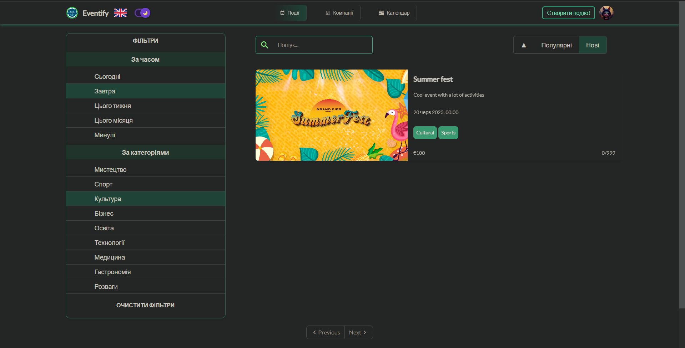

[](https://shields.io/)
[](https://shields.io/)
[](https://shields.io/)
[](https://shields.io/)
[](https://shields.io/)
[](https://shields.io/)

### [🌐 Website](https://eventify-uevent.netlify.app/)  |  [📹 Demo Video](https://www.youtube.com/watch?v=sXvoPSu9GaA)

### API Hosted On
- __[eventify-uusl.onrender](https://eventify-uusl.onrender.com/) (Primary)__

This is a web application for buying tickets and finding companies for events.

This repo consists of the Frontend and Backend code of the project.

## My Tech Stack (MERN)

#### Front-end

- Front-end Framework: `React.js (with Redux)`
- Styling: `Tailwindcss`
- Localization: `i18next`

#### Back-end

- For handling index requests: `Node.js with Express.js Framework`
- As Database: `MongoDB with mongoose`
- API tested using: `POSTMAN`

## Guidelines to setup

### Manual Setup

1. Open your local CLI:

   ```
   git clone https://github.com/Vlad-Makarenko/uevent
   cd uevent
   ```

2. Setup the backend code:
   
   __NOTE:__ For Frontend Developers, if they don't want to setup the Backend Code, they can skip the Step 2, and make sure they follow the optional step mentioned in Step 3

   - Create a `.env` file and the format should be as given in `.env.example`.
   - Go to the `api` directory & install the modules:

     ```
     cd api

     npm install
     ```

   - Run the server `npm start`.

3. Open a new CLI terminal and goto the root `client` folder.
4. Setup the Frontend code -

   - Clone the code & install the modules:

     ```
     cd client

     npm install
     ```

   - Run the client index `npm start`.

## DEMO

#### VIDEO - [Watch the video](https://www.youtube.com/watch?v=sXvoPSu9GaA)


#### Events page


#### Event page


#### payment


#### Companies page


#### Company page


#### Sign in / Sign up forms


#### Create event


#### Create company


#### User page


#### Settings


#### Ukraine localization


#### Dark mode



<h2>Contact</h2>
<h3>vmakarenko</h2>
<p>
<a href="https://github.com/Vlad-Makarenko"></a>
<a href="https://t.me/VladMakarenko"></a>
<a href="https://www.instagram.com/_vlad_makarenko_/"></a>
</p>
<h3>yklymenko</h2>
<p>
<a href="https://github.com/LiquidFunki"></a>
<a href="https://t.me/yurahasatrigger"></a>
<a href="https://www.instagram.com/yurahasatrigger"></a>
</p>